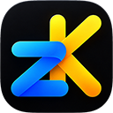

<p></p>

# Znimok

**Українська** · [English](README.en.md)

> **Попередня версія 0.0.17.** Znimok у розробці: функції додаються з кожним оновленням, код і план змінюються.

Знімки екрана для Windows і macOS з редактором, у якому позначки лишаються редагованими:
стрілку, напис чи приховану ділянку можна поправити й через тиждень. Знімки лежать у бібліотеці
на вашому комп'ютері, у власному відкритому форматі; результат іде в буфер обміну, у файл або
одразу людині чи AI-агенту. Запис відео — у попередньому перегляді: зі звуком, курсором, логом DevTools браузера (і dataLayer),
експортом у MP4, GIF і HTML та звітом для розробника. Бібліотеку можна шукати й за текстом на знімках.

Znimok — наступник функцій знімків і відео з [Little Helpers](https://github.com/V-Plum/lilhelpers):
той самий досвід, але новий код на Rust, дві ОС, інсталятор і сучасний інтерфейс. Сумісності з
файлами Little Helpers немає — переноситься функціонал, а не формат.

**[Завантажити →](https://v-plum.github.io/znimok/)** · [Посібник](docs/guide.md) ·
[Клавіші](docs/SHORTCUTS.md) · [Приватність](docs/privacy.md)

## Можливості

- **Знімок** ділянки, вікна (без того, що його перекриває) чи всього екрана, на кількох дисплеях,
  з лупою, відліком 3-2-1, прокруткою довгих сторінок і зчитуванням QR-кодів. Правильна
  експозиція в HDR.
- **Три дії при відпусканні** — у редактор, одразу в буфер і бібліотеку або правити просто
  поверх екрана; що робить кожен жест, можна переназначити.
- **Редактор**: прямокутники й еліпси, лінії з наконечниками, олівець, текст, приховування
  (пікселі, розмиття, плашка), маркер, лічильники, штампи й емодзі, картинки, кадр, поворот,
  тон; довільний колір з піпеткою; групи, шари, поворот позначок; скасування будь-якої дії.
- **Бібліотека** з мініатюрами, пошуком, групами за датою, закріпленими, клавіатурою, вибором кількох карток і кошиком (відновити / знищити); тека може лежати на хмарному диску. Кожен
  документ відкривається у власному вікні — знімки можна порівнювати поруч і перетягувати
  позначки між ними.
- **Відео (попередній перегляд)**: запис ділянки, вікна чи екрана на Windows і macOS; відтворення на
  відеокарті на Windows і macOS (вперед, назад, 0,5–2×, мініатюри на стрічці); обрізання й
  вирізання без перекодування; позначки з часом появи на доріжці; кадр — окремим знімком.
- **Поділитися**: копіювати, перетягнути в чат, експорт у PNG/JPEG/WebP з метаданими.
- **Для агентів**: сервер MCP і команда `znimok` — знімати, читати бібліотеку, правити документи
  (вимкнено, доки не ввімкнете).
- **Приватність**: без телеметрії й реклами; сам Znimok ходить у мережу лише перевірити оновлення.
- Українська й англійська, світла й темна тема, оновлення з перевіркою підпису.

Докладно про кожну функцію — у [посібнику](docs/guide.md).

## Встановлення

Windows 11 — `.msi` (без прав адміністратора), macOS 15+ на Apple silicon — `.dmg`. Поки
інсталятори не підписані сертифікатами Microsoft і Apple, система попередить на першому запуску —
як це пройти, описано в [посібнику](docs/guide.md#встановлення).

## Зібрати самому

```sh
cargo run --release -p znimok-app              # бібліотека
cargo run --release -p znimok-app -- shot.png  # одразу відкрити зображення
```

Змінна `ZNIMOK_LIBRARY` задає іншу теку бібліотеки. Самоперевірка без екрана й миші:
`ZNIMOK_LIBRARY=<тека>/lib ZNIMOK_SELFTEST=<тека> znimok-app <зображення>` проганяє сценарій,
пише знімки вікна й `report.txt` у теку і повертає код 0, коли всі перевірки пройшли. Рендер
перевіряють еталонні зображення (`cargo test -p znimok-render --test golden`; `ZNIMOK_BLESS=1`
оновлює еталони). Шрифти вбудовані: Onest, JetBrains Mono, Unbounded — усі під SIL OFL 1.1
(`crates/znimok-render/fonts`).

## Розробка

- Мова — Rust (edition 2024, stable); робочий простір крейтів — `crates/`.
- Перевірки на кожен push і PR: `cargo fmt --check`, `cargo clippy -D warnings`,
  `cargo test` на Windows і macOS ([.github/workflows/ci.yml](.github/workflows/ci.yml)).
- Задачі ведуться в Jira-проєкті `ZK`. **Кожен коміт, гілка й PR несуть ключ задачі**
  (`ZK-21: …`, гілка `zk-21-workspace`) — так зміни прив'язуються до тікета.
- Основна гілка — `main`; на ній заборонено force-push і видалення.
- Сторінка завантаження — `site/` (статичні файли); воркфлоу `pages` публікує її на
  [v-plum.github.io/znimok](https://v-plum.github.io/znimok/) після змін у `main`.
- Оновлення: Windows — власний оновлювач (підпис SHA256SUMS ECDSA, MSI, відкат, якщо нова
  версія не стартувала); macOS — Sparkle 2 у бандлі, з нашою сторінкою «Оновлення» (перевірка,
  завантаження з перевіркою EdDSA-підпису, перезапуск). Перевірка щодня — лише якщо ввімкнена.
- Відео (Фаза 8): запис — `crates/znimok-video-win` (WGC або дублювання робочого столу → шейдер
  wgpu → NV12 на GPU → апаратний H.264 через Media Foundation; програмний кодувальник — запасний);
  відтворення — `crates/znimok-play` (Media Foundation на D3D11 або VideoToolbox → текстура
  без копіювання через процесор → wgpu). Спробувати запис без застосунку:
  `cargo run --release -p znimok-video-win --example record -- --seconds 5 [--window Назва]`.

## Ліцензія

Код відкритий **для читання, а не для перевикористання**: його можна читати,
перевіряти й збирати для себе, але не поширювати й не вбудовувати в інші проєкти без
письмового дозволу автора. Повний текст — [LICENSE](LICENSE). Шрифти й бібліотеки
лишаються під власними ліцензіями.

Інтерфейс зроблено на [Slint](https://slint.dev) (Royalty-free License 2.0; віджет «Про Slint» —
на сторінці «Про Znimok»).
